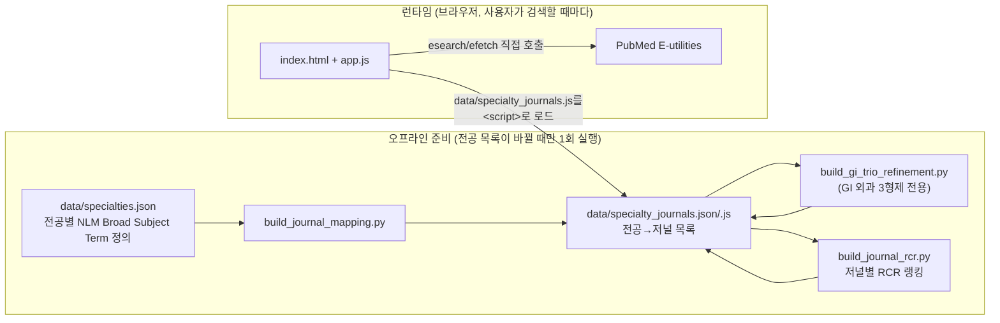

# PubMed 최신 문헌 알리미

연구자가 자신의 전공(임상과/기초의학)을 선택하면, 그 전공과 관련된 PubMed 색인 저널에
최근 게재된 논문을 보여주는 웹 도구입니다. 서버 없이 정적 HTML/JS 파일만으로 동작하며,
브라우저가 PubMed E-utilities API를 직접 호출합니다(무료, 로컬 실행, 외부 유료 API 없음).

## 1. 전체 그림



- **오프라인 준비**: Python(venv)으로 NLM Catalog·PubMed·NIH iCite를 조회해 `data/specialty_journals.json`(.js)을 만든다. 전공 목록이나 매핑 기준을 바꿀 때만 다시 실행하면 된다.
- **런타임**: 정적 페이지가 그 결과 파일을 읽어와, 사용자가 검색 버튼을 누를 때마다 PubMed에 직접 질의한다. 서버도, LLM 호출도 없다.

## 2. 디렉터리 구조

```
data/
  specialties.json          # 입력: 전공별 카테고리 + NLM Broad Subject Term (사람이 관리)
  specialty_journals.json   # 출력: 전공별 저널 목록 + MeSH 정밀화 + RCR (빌드 스크립트가 생성)
  specialty_journals.js     # 위 json을 <script>로 바로 로드하기 위한 래퍼 (자동 생성)
  nlm_broad_subject_terms.json  # 참고용: NLM Catalog가 실제 지원하는 Broad Subject Term 전체 목록
scripts/
  build_journal_mapping.py      # 1단계: 전공 → NLM Catalog 저널 목록
  build_gi_trio_refinement.py   # 2단계: GI 외과 3형제(간담췌/위장관/대장항문) MeSH 정밀화
  build_journal_rcr.py          # 3단계: 저널별 NIH iCite RCR 랭킹 산출
web/
  index.html / style.css / app.js   # 실제 서비스 화면 (서버 불필요, 정적 파일)
requirements.txt   # 스크립트는 표준 라이브러리만 사용 (설치 불필요, 문서화 목적)
```

## 3. 실행 방법

```powershell
# 1) (최초 1회, 이미 되어 있음) 가상환경
python -m venv .venv

# 2) 데이터 준비 (specialties.json을 바꿨을 때만)
.venv\Scripts\python.exe scripts\build_journal_mapping.py
.venv\Scripts\python.exe scripts\build_gi_trio_refinement.py
.venv\Scripts\python.exe scripts\build_journal_rcr.py   # 저널 3천여 개 esearch라 20분 이상 소요

# 3) 서비스 실행 (로컬 전용, 무료)
.venv\Scripts\python.exe -m http.server 8765
# 브라우저에서 http://localhost:8765/web/index.html
```

> `index.html`을 파일로 직접 열면(file://) 브라우저 정책상 PubMed 호출이 막힐 수 있어
> 위처럼 로컬 서버로 여는 것을 권장한다. (완전 로컬 실행이라 비용은 없다.)

## 4. 전공 → 저널 매핑 규칙

### 4-1. 기본 방식: NLM Catalog Broad Subject Term

각 저널은 NLM Catalog에 **Broad Subject Term**(공식 125개 통제 어휘, `[st]` 필드)으로
분류되어 있다. `data/specialties.json`에서 전공마다 이 용어를 1개 이상 지정하면,
빌드 스크립트가 `"{용어}"[st] AND currentlyindexed[all]`로 검색해 현재 색인 중인 저널
목록을 만든다.

**설계 원칙(재현율 우선)**: 외과 세부분과에는 장기별 용어에 `General Surgery`를,
내과 세부분과에는 `Internal Medicine`을 함께 포함시켰다. 이렇게 해야 그 분야의
종합 저널(예: *Annals of Surgery*, *Annals of Internal Medicine*)에 실린 논문을
놓치지 않는다. 대신 결과 건수와 무관한 논문 비율은 늘어난다 — 이 프로젝트는
"놓치지 않는 것"을 "결과가 적은 것"보다 우선한다.

**일반의학** 카테고리는 예외로, `Medicine`(broadheading) 저널만 모아 별도 취급한다.
NEJM/JAMA/Lancet/BMJ/PLoS Medicine이 여기 해당하며, 각 임상과에는 섞이지 않는다
(임상과들은 `Medicine`을 용어로 쓰지 않기 때문).

**알려진 한계**: NLM의 125개 용어는 조직/질환 단위로만 나뉘어 있어, 아래 쌍은
저널 목록이 완전히 겹친다.
- 소아외과 = 소아청소년과 (`Pediatrics`만 존재, 소아외과 전용 용어 없음)
- 종양내과 ≠ 유방외과 (유방외과는 `Neoplasms + General Surgery`로 이미 구분됨)

### 4-2. 예외: GI 외과 3형제 (MeSH 기반 정밀 판별)

간담췌외과·위장관외과·대장항문외과는 전부 `Gastroenterology + General Surgery`를
공유해 위 방식으로는 구별이 안 된다. 이 세 곳만 `mesh_refinement` 필드로 별도 처리한다.

1. **실시간 판별**: 검색 시 저널 목록 대신, 각 분과에 특이적인 실제 MeSH 디스크립터로
   직접 질의한다(예: 대장항문외과 = `Colorectal Surgery`, `Colectomy`,
   `Proctocolectomy, Restorative`, `Rectum/surgery`, `Anal Canal/surgery`).
2. **핵심저널 안전망**: PubMed의 MeSH 색인은 등재 후 며칠~몇 주 지연되므로, "최근 3일"
   같은 기본 뷰에서는 논문 대부분이 아직 MeSH가 없다. 그래서 `build_gi_trio_refinement.py`가
   "그 MeSH가 실제로 최근 어느 저널에 많이 실렸는가"를 직접 집계(2023~2026년 표본 500건,
   표본의 85%를 커버할 때까지 또는 최대 25개)해 상위 저널만 안전망으로 추가한다. 사람이
   기억으로 고른 목록이 아니라 데이터로 산출한 목록이다.

### 4-3. 중항목(세부 분류) 체크박스

전공에 광역 용어가 2개 이상 묶여 있으면(예: 심장혈관흉부외과 = Cardiology + Pulmonary
Medicine + Vascular Diseases) 화면에 세부 분류 체크박스가 나타난다. 기본은 전체 선택
(= 완전 재현)이며, 해제하면 저널이 이미 갖고 있는 `broadheading` 데이터로 클라이언트에서
바로 좁혀진다(추가 API 호출 없음). GI 3형제처럼 `mesh_refinement`가 있는 전공은 이 체크박스
대신 MeSH 판별을 쓰므로 체크박스가 뜨지 않는다.

## 5. 날짜 조건 (신규 논문 판정 기준)

| 필드 | 용도 |
|---|---|
| **CRDT** (Create Date) | **주 기준.** PubMed 레코드가 처음 생성된 날짜. |
| DP (Date of Publication) | **보조 조건만.** 오래된 논문이 뒤늦게 소급 등록되는 것을 줄이기 위한 안전장치. |
| EDAT / EPDAT / MHDA / 수정일 | **사용하지 않음.** 신규 논문 판정 기준으로 쓰지 않는다. |

실제 검색식(`web/app.js`의 `buildDateFilter`):

```
(<검색식>) AND "last N days"[crdt] AND "last 2 years"[dp]
```

- `N`은 3 / 10 / 30(기본값) 또는 사용자가 입력한 1~30 사이 값.
- `"last N days"[crdt]`는 PubMed가 서버에서 직접 계산하므로, 당일 오전/오후 생성
  시각 경계로 인한 누락 문제가 없다(직접 API로 검증함).
- 커스텀 입력도 최대 30일로 제한한다(API 호출량 관리 목적, 최초 설계 원칙).

> 참고: 만약 향후 "YYYY/MM/DD:YYYY/MM/DD" 같은 명시적 날짜 구간 검색을 추가한다면,
> 당일 오전/오후 생성분 누락을 막기 위해 구간 경계를 1일 중첩시키는 것을 권장한다
> (예: crdt 구간 자체는 서버가 자정 단위로 계산하지만, 사람이 날짜를 직접 지정할 때는
> 하루 여유를 두는 것이 안전하다).

## 6. 정렬 옵션

| 옵션 | 동작 |
|---|---|
| 최신순 (기본) | PubMed `sort=pub date` |
| 관련도순 | PubMed `sort=relevance` |
| 핵심저널 우선 (RCR) | PubMed에서 최신순으로 받아온 뒤, **이미 받아온 페이지 내에서만** 저널의 RCR 중앙값으로 재정렬. PubMed 자체 정렬이 아니므로, 더 오래된 페이지에 있는 고RCR 논문은 끌어올 수 없다. |

**RCR(Relative Citation Ratio)**: NIH iCite(무료 공식 API)에서 산출한 분야보정 인용
영향력 지표. SJR(SCImago)은 자동 다운로드가 봇 차단(403)되어 대체 불가했다.
저널마다 2~5년 전 논문 중 원저 성격 논문만(뉴스/사설/편지/환자교육자료 등 제외) 30편을
표본으로 중앙값을 계산했고, 표본이 5건 미만인 저널은 신뢰할 수 없어 점수를 비워둔다
(전체 3244개 저널 중 3167개, 약 97.6%에 점수 존재).

## 7. 화면 기능

- **페이지네이션**: 20건씩, PMID 목록은 한 번에 받아두고 상세정보(초록 등)는 보이는
  페이지만 호출한다.
- **서지정보 표기 순서**: 저널 · 날짜 · 저자(등) · `PMID: ...` · `DOI: ...` · `(저널 RCR ...)`
- **Article Type 배지**: 제목 앞에 `[Review]`, `[Randomized Controlled Trial]` 등 표시.
  `Journal Article`, `Research Support, ...` 같은 변별력 없는 태그는 제외.
- **초록**: 2줄 클램프 + 펼치기/접기.
- **TL;DR**: 규칙 기반 추출 요약(무료, LLM 미사용). 구조화 초록의 CONCLUSION/INTERPRETATION
  라벨을 우선 사용하고, 없으면 마지막 섹션, 그마저 없으면 단어 빈도 기반으로 핵심 문장을 고른다.
  어디까지나 참고용 초안이다.
- **링크**: PubMed 원문, 출판사 DOI, (OA인 경우) PMC 무료 전문 + PDF 다운로드.
- **CSV 다운로드**: 현재 페이지가 아니라 **검색된 전체 결과**를 대상으로 생성(아직 안 불러온
  페이지는 이때 추가로 efetch). Excel 한글 깨짐 방지를 위해 UTF-8 BOM 포함.

## 8. 보류된 항목

- **EBSCO Full Text Finder 연동**: 도서관 라이선스로 연결 가능한지 추가 확인이 필요해 보류.
- **기초의학 전공 목록**: 아직 확정되지 않음 (현재 `생리학` 하나만 예시로 존재).

## 9. 데이터 재생성이 필요한 시점

- `data/specialties.json`의 전공 목록/용어를 바꿨을 때 → `build_journal_mapping.py`
  (그리고 GI 3형제를 건드렸다면 `build_gi_trio_refinement.py`)를 다시 실행.
- 새 저널이 추가되었거나 오래돼서 RCR을 다시 계산하고 싶을 때 → `build_journal_rcr.py`
  (저널 수천 개를 esearch로 순회하므로 20분 이상 걸림, 백그라운드 실행 권장).
- 세 스크립트 모두 `data/specialty_journals.json`과 `.js`를 덮어쓰며, 기존 필드를
  누적/갱신하는 방식이라 순서대로 실행하면 안전하다.
